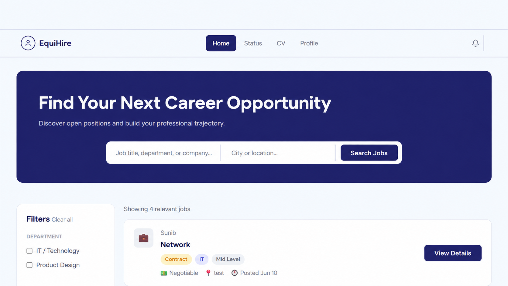
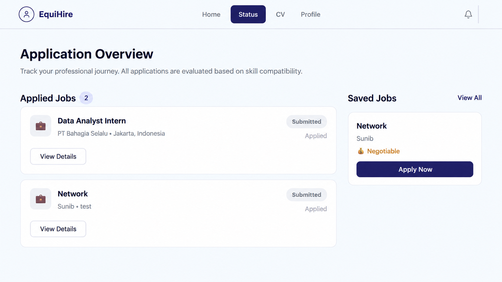
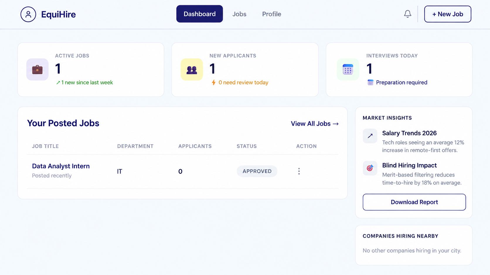
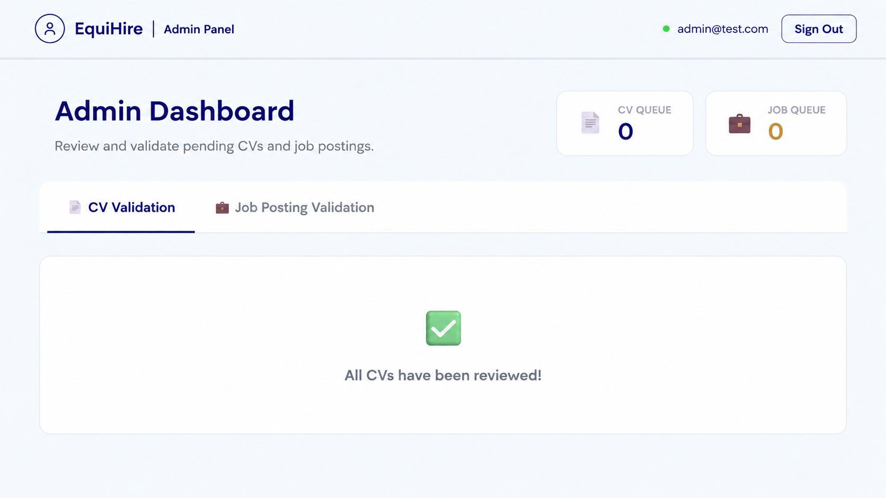

# EquiHire

EquiHire is a web-based recruitment platform designed to connect job seekers and companies through a structured hiring workflow.

The platform provides dedicated interfaces for **Job Seekers**, **Companies / Recruiters**, and **Administrators**, allowing each role to manage different stages of the recruitment process.

This project was developed as an academic **Software Engineering group project**.

---

## Preview

### Job Seeker Home



### Application Status



### Company Dashboard



### Admin Dashboard



---

## Features

### Job Seeker

Job seekers can:

- Register and log in
- Browse available job opportunities
- Search and filter job opportunities
- View job details
- Save jobs
- Upload a CV
- Submit a CV for admin review
- Apply for jobs after CV approval
- Prevent duplicate applications to the same vacancy
- Track submitted applications
- Manage personal profile information

### Company / Recruiter

Companies can:

- Register and log in
- Manage company information
- Create new job postings
- Submit job postings for admin approval
- Manage existing vacancies
- View active job postings
- Monitor applicants
- View applicant pipelines for each vacancy

### Administrator

Administrators can:

- Log in through a dedicated admin interface
- Review uploaded CVs
- Approve or reject CV submissions
- Review submitted job postings
- Approve or reject job vacancies
- Monitor pending CV and job queues

---

## Recruitment Workflow

EquiHire uses an approval-based recruitment workflow.

### Job Posting Flow

```text
Company Creates Job
        ↓
Admin Reviews Job
        ↓
Admin Approves Job
        ↓
Job Becomes Available to Users
```

### Application Flow

```text
User Uploads CV
        ↓
Admin Reviews CV
        ↓
CV is Approved
        ↓
User Applies for Job
        ↓
Application is Recorded
        ↓
Company Can View Applicant
```

---

## Tech Stack

### Frontend

- React
- Vite
- JavaScript
- Axios
- CSS

### Backend

- Node.js
- Express.js
- REST API
- JWT Authentication
- bcrypt
- Multer

### Database

- Microsoft SQL Server
- SQL Server Express
- mssql
- ODBC Driver 17 for SQL Server

### Development Tools

- Visual Studio Code
- Git
- GitHub
- npm

---

## Authentication and Authorization

EquiHire implements role-based authentication for three types of accounts:

- Job Seeker
- Company
- Administrator

Authentication is handled using **JSON Web Tokens (JWT)**.

Passwords are hashed before being stored in the database.

Protected backend routes verify authentication and user roles before allowing access to restricted functionality.

---

## CV Upload System

Job seekers can upload CV documents through the platform.

Uploaded CV files are stored locally inside:

```text
backend/uploads/cvs/
```

Uploaded files are excluded from Git version control for privacy and security.

Only the `.gitkeep` file is included so that the required folder remains available after cloning the repository.

---

## Project Structure

```text
EquiHire/
│
├── backend/
│   ├── config/
│   │   ├── db.js
│   │   └── schema.js
│   │
│   ├── middleware/
│   │   ├── auth.js
│   │   └── upload.js
│   │
│   ├── routes/
│   │   ├── admin.js
│   │   ├── auth.js
│   │   ├── companies.js
│   │   ├── jobs.js
│   │   └── users.js
│   │
│   ├── uploads/
│   │   └── cvs/
│   │       └── .gitkeep
│   │
│   ├── .env.example
│   ├── .gitignore
│   ├── package.json
│   └── server.js
│
├── frontend/
│   ├── public/
│   ├── src/
│   │   ├── assets/
│   │   ├── components/
│   │   ├── context/
│   │   ├── pages/
│   │   │   ├── admin/
│   │   │   ├── auth/
│   │   │   ├── company/
│   │   │   └── user/
│   │   ├── services/
│   │   ├── styles/
│   │   ├── App.jsx
│   │   └── main.jsx
│   │
│   ├── .gitignore
│   ├── package.json
│   └── vite.config.js
│
├── docs/
│   ├── home.png
│   ├── application-status.png
│   ├── company-dashboard.png
│   └── admin-dashboard.png
│
├── .gitignore
└── README.md
```

---

## Getting Started

### Prerequisites

Make sure the following are installed:

- Node.js
- npm
- Microsoft SQL Server / SQL Server Express
- ODBC Driver 17 for SQL Server
- Git

---

## Installation

### 1. Clone the Repository

```bash
git clone https://github.com/ayundini586/equihire.git
cd equihire
```

### 2. Create the Database

Create a Microsoft SQL Server database named:

```text
SoftwareEngineeringGroupProject
```

The backend will initialize the required application tables when the server starts.

### 3. Backend Setup

Open the backend folder:

```bash
cd backend
```

Install dependencies:

```bash
npm install
```

Create a `.env` file inside the `backend` folder.

You can use `.env.example` as the template.

Example:

```env
DB_SERVER=localhost\SQLEXPRESS
DB_DATABASE=SoftwareEngineeringGroupProject
JWT_SECRET=YOUR_SECURE_JWT_SECRET
PORT=5000
```

Generate a secure JWT secret with:

```bash
node -e "console.log(require('crypto').randomBytes(32).toString('hex'))"
```

Start the backend server:

```bash
npm start
```

If the connection is successful, the backend runs on:

```text
http://localhost:5000
```

### 4. Frontend Setup

Open another terminal and move into the frontend folder:

```bash
cd frontend
```

Install dependencies:

```bash
npm install
```

Run the development server:

```bash
npm run dev
```

The frontend will normally run on:

```text
http://localhost:5173
```

---

## Environment Variables

The real `.env` file is intentionally excluded from GitHub.

The repository only provides:

```text
backend/.env.example
```

Sensitive information such as the following should never be committed:

- Database credentials
- JWT secrets
- Private environment variables
- Uploaded CV files

---

## Application Roles

| Role | Main Functions |
|---|---|
| Job Seeker | Browse jobs, upload CV, save jobs, apply, and track applications |
| Company | Create vacancies, manage job postings, and monitor applicants |
| Administrator | Review CV submissions and validate job postings |

---

## Tested Workflow

The following core user workflow has been tested locally:

```text
User Registration
        ↓
User Login
        ↓
Browse Jobs
        ↓
View Job Details
        ↓
Save Job
        ↓
Upload CV
        ↓
Admin Approves CV
        ↓
Apply for Job
        ↓
Application Appears in Status Page
```

The company recruitment workflow has also been tested:

```text
Company Registration
        ↓
Company Login
        ↓
Create Job Posting
        ↓
Admin Approves Job
        ↓
Job Appears to Job Seekers
        ↓
User Applies
        ↓
Applicant Appears in Company Pipeline
```

Duplicate applications to the same job are prevented by the system.

---

## Security Considerations

The project includes several basic security practices:

- Password hashing
- JWT-based authentication
- Protected backend routes
- Role-based access control
- Environment variables for sensitive configuration
- Uploaded CV files excluded from Git
- Local database backup files excluded from the public repository

---

## Git Ignore Policy

The repository intentionally excludes local or sensitive files such as:

```text
node_modules/
.env
dist/
backend/uploads/cvs/*
DatabaseSoftwareEngineering.bacpac
```

This prevents dependencies, environment configuration, uploaded user documents, and local database backups from being published.

---

## Future Improvements

Possible future development includes:

- Cloud-based CV storage
- Email notifications
- Interview scheduling
- More detailed recruitment status tracking
- Applicant filtering and sorting
- Company analytics
- Advanced job recommendations
- Automated testing
- Responsive UI improvements
- Production deployment

---

## Project Status

The main recruitment workflow is functional in the local development environment.

Implemented and tested functionality includes:

- User authentication
- Company authentication
- Admin authentication
- Job browsing
- Job searching
- Job saving
- CV upload
- CV approval
- Job creation
- Job approval
- Job applications
- Duplicate application prevention
- Application tracking
- Company applicant pipeline
- User profile management

---

## Contributors

Developed as a group project for the Software Engineering course.

Team members:

- Ayundini Nursyahrin
- Jovita Niken Angelia Putri
- Joyce Velensia
- Rio Dwi Chandra
- Yuan Fellix

---

## License

This project was developed for educational and portfolio purposes.